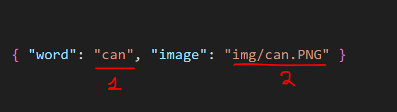
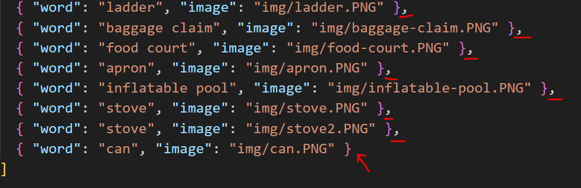

# CELPIP Vocabulary Practice 

Welcome to the Celpip Vocabulary Practice repository which is a fun and visual way to prepare for the CELPIP exam!
This tool helps you learn and review essential vocabulary through pictures, making it easier to remember new words.

Access the app through my website: https://hrayrmuradyan.com/celpip-vocabulary/

## Motivation

In the CELPIP exam, you are often asked to describe images in detail, especially in 3 key speaking tasks.
To do well, you need to recall them quickly and use them naturally in context.

By training vocabulary through visuals, you are not just building your verbal memory, but also strengthening your visual memory.
It makes much easier to remember and retrieve words when describing images under time pressure.

Visual learning is one of the most powerful ways to internalize vocabulary, and this tool makes it both effective and engaging.

## How it works?

1️⃣ You will see a series of images, one at a time.  
2️⃣ Your task is to type the correct word that describes the picture or certain objects that are highlighted.

**Note:** Some images can be described using more than one correct word.
If your answer feels right but isn’t accepted, you can either:

- Click the "Show Correct Answer" button to reveal the expected answer,
- Check the vocab.json file to customize or review the accepted responses (Only if ran locally through `vocab.json` file).

This way, you can tailor the experience to your preferences and learning style.

**Note:** Since the project is designed for improving speaking, there might be some grammatical errors in the words. Please refer to `Contributing` section for more information about how to let me know about the issues.

## Demo

<video width="600" controls>
  <source src="./assets/demo.mov" type="video/mp4">
  Your browser does not support the video tag.
</video>

## Future plans

- "Show Correct Answer" should increment +1 to the incorrect attempts counter.
- Work a bit more on the design.
- Add a mute button to disable the sound.
- Add several options for a single image instead of just one correct word. Also, remove the difference between plural and singular versions of the answer for certain words. For example, calf and calves should both be correct. 
- Repeat those images at the end that were answered incorrectly.

## Run locally

To run locally, proceed with the following instructions:

1. Clone the repository:

    ```bash
    # Through ssh
    git@github.com:HrayrMuradyan/celpip-vocabulary.git
    ```
    or
    ```bash
    # Through https
    https://github.com/HrayrMuradyan/celpip-vocabulary.git
    ```

2. Navigate to the root directory:

    ```bash
    cd celpip-vocabulary
    ```

3. Adjust the vocabulary file `vocab.json` (Optional)

    1. The correct word or the answer (Ignores uppercase letters).
    2. Path to the image that is going to be shown in the game.    

    Example line in the `vocab.json` file.
    

    You can add as many words and images as you want by adding new lines.

    Note that only the last row doesn't have a comma at the end of a line as shown here:  
    <br>
    

4. Run the server using python:

    ```bash
    python -m http.server 8890
    ```

    The port `8890` can be changed to any if not available.  
    After the server is launched navigate to: [http://localhost:8890/](http://localhost:8890/)


## Contributing

For contributing, please refer to the [CONTRIBUTING.md](./CONTRIBUTING.md) file.

## License

The project is licensed under MIT License. For more details, refer to the [LICENSE.md](./LICENSE.md) file.

All images listed in the `vocab.json` file belong to their respective owners.
If you are the rightful owner of any image and would like it removed, please contact me at hrayrmuradyan20@gmail.com, and I will take it down promptly.


